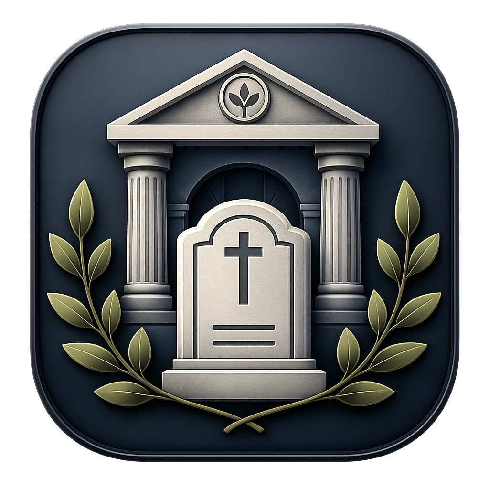
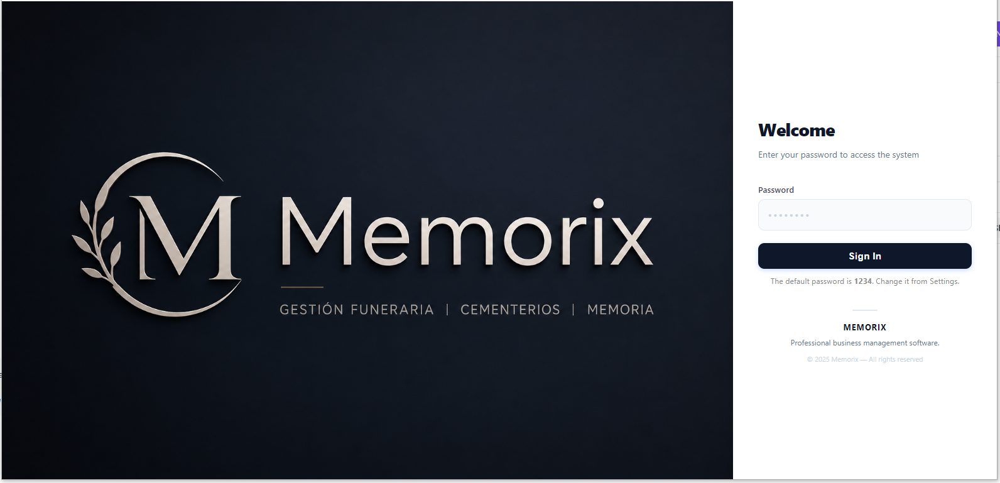
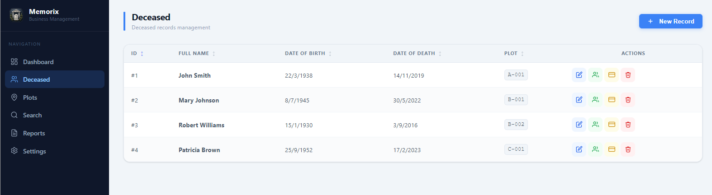
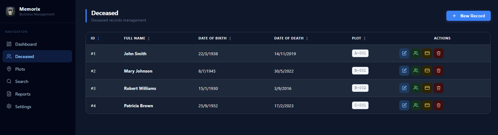
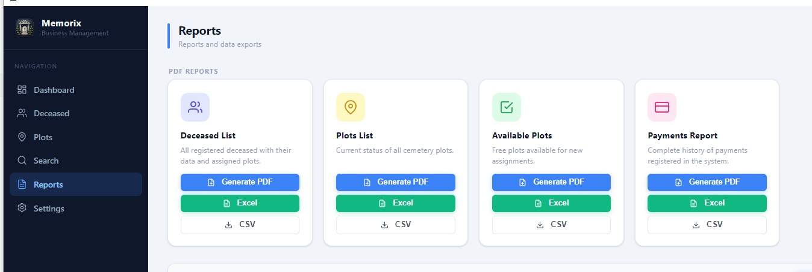
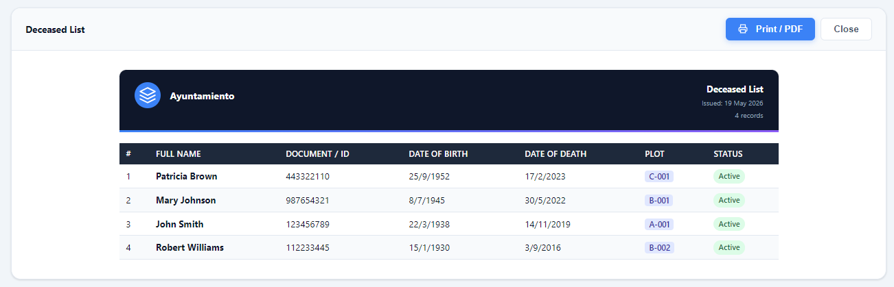
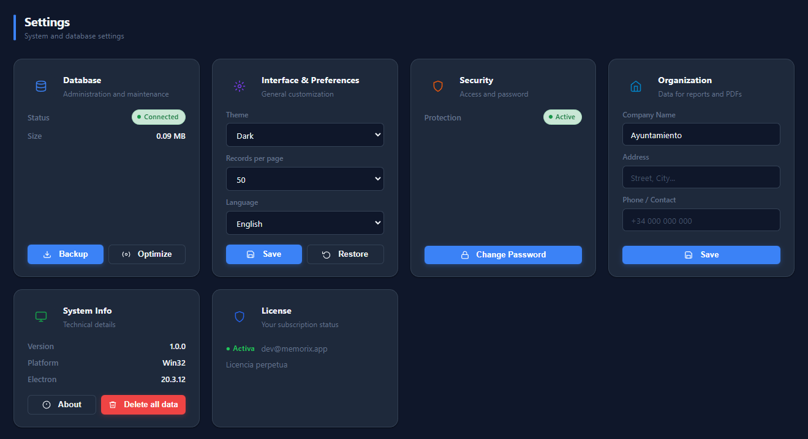

# Memorix

### Professional Cemetery Management Software

**Memorix** is a desktop application that simplifies every aspect of cemetery administration — from plot management to deceased records, PDF reports, and real-time statistics. Built for efficiency, designed for professionals.

[**Buy Now — €129.99 / year**](https://memorix.lemonsqueezy.com/checkout) &nbsp;·&nbsp; [Download](https://github.com/jopasma7/Memorix/releases/latest) &nbsp;·&nbsp; [Support](#support)

---

## Screenshots

### Secure access
> Password-protected login screen. Clean and minimal — gets out of the way fast.

---

### Deceased records
> Full registry of deceased individuals with personal details, death information, and plot assignment. Sortable, searchable, and exportable.

 

---

### PDF Reports — document view
> Generate print-ready PDF documents directly from any table view. Reports include your organization's name and contact details automatically.

---

### PDF Reports — print preview
> Full print preview before sending to the printer or saving as a file.

---

### Settings & customization
> Configure your organization details, switch between light and dark theme, change language, and manage your license — all in one place.

---

## Why Memorix?

Managing a cemetery involves dozens of moving parts — tracking which plots are available, keeping accurate records of the deceased, generating official documents, and maintaining historical data. Most organizations still do this with spreadsheets or paper, which is slow, error-prone, and hard to audit.

**Memorix replaces all of that** with a clean, fast desktop application that works entirely offline — no subscriptions to external services, no data sent to the cloud, no setup required beyond installation.

---

## Features

### Dashboard & Activity
- Real-time statistics — total plots, occupancy rate, recent registrations
- Activity feed showing every operation performed in the system
- Quick navigation to any section directly from the dashboard

### Plot Management
- Register plots with type (Plot, Niche, Mausoleum), zone, location and status
- Status tracking: Available, Occupied, Reserved, Maintenance
- Automatic status updates when a deceased record is assigned or removed
- Customizable labels and categories in your language

### Deceased Records
- Complete records: full name, ID, birth date, death date, birthplace, cause of death
- Direct assignment to an available plot
- Advanced search by name, dates, or any combination of fields
- Logical deletion that preserves all historical data

### PDF Reports
- Generate professional PDF reports from any table view
- Reports include your organization name, address, and logo area
- Print-ready formatting

### Settings & Customization
- Light and dark theme
- English and Spanish interface
- Configurable records per page
- Organization info (name, address, phone) used across all reports
- Password-protected access

### License & Updates
- License tied to your machine — one purchase, one installation
- Automatic updates via GitHub Releases — always up to date
- Full offline operation after activation

---

## System Requirements

| | Minimum |
|---|---|
| **OS** | Windows 10 (64-bit) or later |
| **RAM** | 256 MB |
| **Storage** | 150 MB free space |
| **Internet** | Required only for license activation and updates |

---

## Getting Started

### 1. Purchase a License

Go to the store and complete the purchase:

**[memorix.lemonsqueezy.com/checkout](https://memorix.lemonsqueezy.com/checkout)**

You will receive a license key by email immediately after payment.

### 2. Download the Installer

Download the latest `.exe` installer from the [Releases page](https://github.com/jopasma7/Memorix/releases/latest).

### 3. Install & Activate

Run the installer, open Memorix, and enter your license key when prompted. That's it — the app is ready to use.

> **Default password:** `1234` — change it from Settings after first login.

---

## Pricing

| Plan | Price | Includes |
|---|---|---|
| **Annual License** | €129.99 / year | All features, automatic updates, email support |

A **7-day free trial** is included — no payment required to evaluate the software.

---

## Support

Having trouble or need help getting set up?

📧 **[bblottus@gmail.com](mailto:bblottus@gmail.com)**

Response within 1–2 business days.

---

## Changelog

### v1.0.0 — Initial Release
- Complete plot and deceased record management
- PDF report generation
- Real-time dashboard with statistics and activity feed
- English and Spanish interface
- Light and dark theme
- License system with annual subscription
- Automatic updates

---

Made with care for cemetery administrators everywhere.

**[Get Memorix →](https://memorix.lemonsqueezy.com/checkout)**

